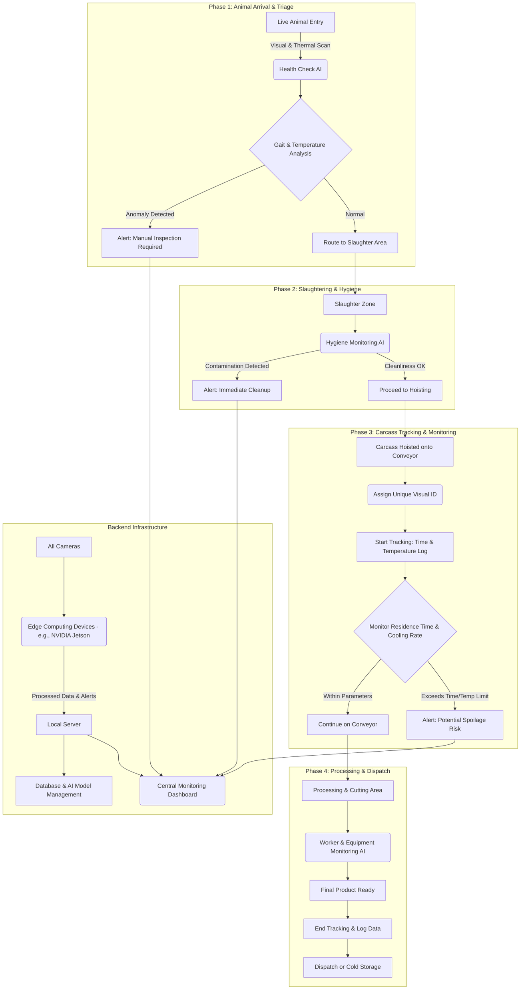
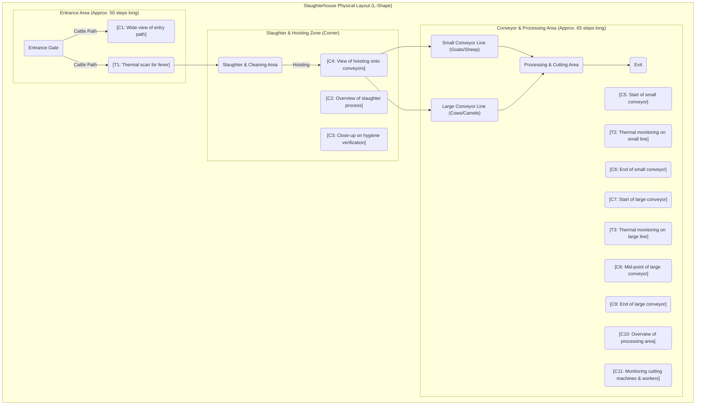

أهلاً بك، يسعدني جداً مساعدتك في هذا المشروع الطموح والمهم. فكرتك ممتازة وتوظيف الذكاء الاصطناعي ورؤية الحاسوب في هذا المجال سيحقق نقلة نوعية في الكفاءة، السلامة، والجودة. بناءً على وصفك المفصل، قمت بإعداد رؤية شاملة وخطة عمل متكاملة لمشروعك، مع التركيز على الجوانب التقنية التي استفسرت عنها.

دعنا نطلق على المشروع اسم: **نظام المسلخ الذكي للمراقبة (Smart Abattoir Monitoring System - SAMS)**.

-----

### **1. توصيات الكاميرات والمستشعرات (Cameras and Sensors)**

اختيارك للابتعاد عن الحلول التقليدية والتركيز على حساسات قوية مثل سوني هو قرار صائب. إليك التوصيات:

#### **الكاميرات الأساسية (Visual Cameras):**

  * **النوع:** كاميرات شبكية صناعية (Industrial IP Cameras) بدقة **4K** لضمان التقاط أدق التفاصيل اللازمة لنماذج الذكاء الاصطناعي.
  * **المستشعر (Sensor):** ابحث عن كاميرات تستخدم مستشعرات **Sony STARVIS CMOS** أو ما يماثلها. هذه المستشعرات تتميز بأدائها الاستثنائي في ظروف الإضاءة المنخفضة، وهو أمر ضروري لمراقبة عمليات التنظيف بعد ساعات العمل أو في المناطق ذات الإضاءة الضعيفة.
  * **العدسة (Lens):** استخدم عدسات متغيرة البؤرة (Varifocal Lenses) لتتمكن من تعديل زاوية الرؤية ومجال التركيز بدقة لكل منطقة مراقبة بعد التركيب.
  * **ميزات إضافية ضرورية:**
      * **Wide Dynamic Range (WDR):** لموازنة الإضاءة في المشاهد التي تحتوي على مناطق ساطعة جداً (مثل الأبواب المفتوحة) ومناطق مظلمة في نفس الوقت.
      * **IP67 Rating:** يجب أن تكون الكاميرات مقاومة للماء والغبار بشكل كامل، حيث أن بيئة المسلخ تتطلب غسيلاً وتنظيفاً مستمراً.
      * **دعم بروتوكول ONVIF:** لضمان التوافق مع مختلف أنظمة إدارة الفيديو (VMS) وأجهزة التسجيل.

#### **الكاميرات الحرارية (Thermal Cameras):**

نعم، **أنت بالتأكيد بحاجة إلى كاميرات حرارية**. هي ليست مجرد إضافة، بل جزء أساسي لتحقيق أهدافك:

  * **فائدة عند المدخل:** يمكن للكاميرا الحرارية فحص درجة حرارة الماشية عند الدخول بشكل فوري وبدون تلامس. أي حيوان يعاني من حمى (علامة شائعة للمرض) يمكن اكتشافه فوراً وتنبيه المسؤولين لعزله وفحصه. هذا يرفع من مستوى السلامة الغذائية.
  * **فائدة على خط الإنتاج:** فائدتها الكبرى هنا هي **مراقبة معدل تبريد اللحوم**. يمكنك تحديد معايير زمنية وحرارية (مثلاً: يجب أن تنخفض حرارة الذبيحة إلى X درجة خلال Y دقيقة). إذا بقيت قطعة لحم معلقة لفترة أطول من اللازم في الحرارة المرتفعة، سترصد الكاميرا الحرارية أن حرارتها لم تنخفض بالمعدل المطلوب، مما يطلق تنبيهاً فورياً. هذا يحل مشكلتك المتعلقة بتأثير حرارة الجو على جودة اللحم.
  * **التتبع:** بينما لا تستطيع الكاميرا الحرارية "تتبع" اللحم كبصمة فريدة، فإن بياناتها عند ربطها ببيانات الكاميرا العادية ونظام التتبع البصري (Visual Tracking) تعطي ملفاً كاملاً لكل ذبيحة: **معرف فريد + سجل زمني + سجل حراري**.

-----

### **2. المخطط الهيكلي للنظام (System Architecture)**

هذا هو المخطط الذي يوضح تدفق العمليات والبيانات في النظام المقترح. لقد قمت بتحسين وتطوير الفكرة التي عرضتها من المطور السابق لتكون أكثر احترافية ووضوحاً باللغة الإنجليزية.

-----

### **3. مخطط توزيع الكاميرات على المسلخ (Slaughterhouse Layout & Camera Placement)**

بناءً على وصفك للأبعاد والشكل (حرف L)، هذا هو تصور لتوزيع الكاميرات المقترح. لقد قمت برسمه باستخدام كود ليكون واضحاً وقابلاً للتعديل.

  * **C\#**: كاميرا مرئية (Visual Camera)
  * **T\#**: كاميرا حرارية (Thermal Camera)

<!-- end list -->

**تقدير عدد الكاميرات:**
بناءً على هذا المخطط، ستحتاج إلى:

  * **9 كاميرات مرئية (4K IP Cameras).**
  * **3 كاميرات حرارية.**
  * **المجموع: 12 كاميرا** موزعة استراتيجياً لتغطية كل المراحل بدون نقاط عمياء.

-----

### **4. نماذج الذكاء الاصطناعي المطلوبة (Required AI Models)**

لتحقيق كل هذه الوظائف، ستحتاج إلى تطوير أو استخدام مجموعة من نماذج رؤية الحاسوب المتخصصة:

1.  **نموذج التعرف على أنواع الماشية (Animal Classification):** للتمييز بين جمل، بقرة، ماعز، إلخ. وتوجيه البيانات بناءً على ذلك.
2.  **نموذج تحليل المشية والحركة (Gait Anomaly Detection):** يستخدم تقنية تقدير الهيكل العظمي (Pose Estimation) لتحديد ما إذا كان الحيوان يمشي بشكل طبيعي أو يعرج، مما قد يدل على مرض أو إصابة.
3.  **نموذج التتبع متعدد الأجسام (Multi-Object Tracking):** هذا هو النموذج الأهم لخط الإنتاج. بمجرد تعليق الذبيحة، سيقوم هذا النموذج (مثل DeepSORT) بإعطائها **معرفاً فريداً (Unique ID)** ويتتبعها عبر الكاميرات المختلفة على طول السير. هذا يحل مشكلة عدم وضوح البطاقات المعلقة.
4.  **نموذج التعرف على الإجراءات (Action Recognition):** لمراقبة منطقة الذبح والتأكد من اتباع الخطوات الصحيحة ومراقبة عمليات التنظيف والتعقيم.
5.  **نموذج كشف الحالات الشاذة (Anomaly Detection):** لرصد أي أحداث غير متوقعة مثل سقوط شيء على الأرض، انزلاق عامل، أو توقف الآلات.
6.  **نموذج قراءة البيانات الحرارية (Thermal Data Analysis):** لتحليل بيانات الكاميرات الحرارية وإطلاق التنبيهات بناءً على معايير محددة مسبقاً (درجة حرارة مرتفعة للحيوانات، أو معدل تبريد بطيء للحوم).

أتمنى أن تكون هذه الرؤية المتكاملة والمخططات التفصيلية نقطة انطلاق قوية لمشروعك. هذا النظام سيمنحك سيطرة كاملة وقائمة على البيانات لضمان أعلى معايير الجودة والسلامة والكفاءة. إذا كان لديك أي أسئلة أخرى، فلا تتردد في طرحها.
